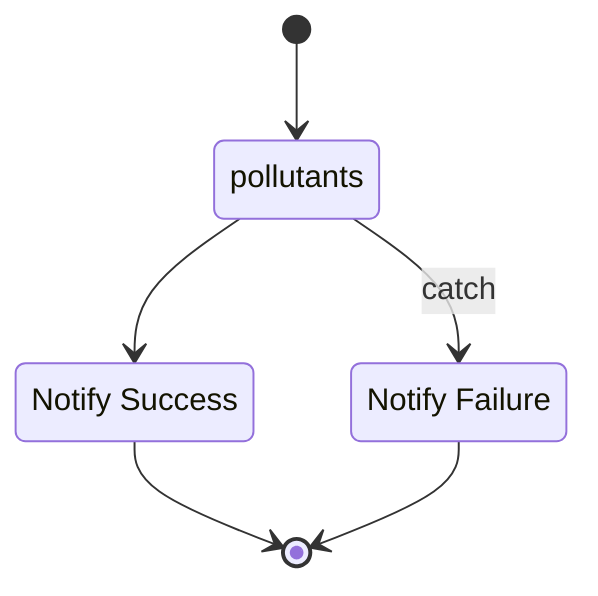

 

<b>IN PROGRESS</b>

 

master  

develop  

 

**Part I**

This package repository retrieves baseline/historical nitrogen dioxide readings recorded at particular *telemetric devices locations* within Scotland.  Within Amazon Web Services, a container instance of the repository is run via a Step Functions state machine.  The container is an instance of this repository.  In brief,

* Foremost, a GitHub Actions event **(a)** builds an image of this repository, **(b)** delivers the image to an Amazon Elastic Container Registry repository.

* Next, at runtime the State Machine pulls the image from the registry and creates a runtime container.  The container reads the raw data, structures it, and delivers the structured data to a specified Amazon S3 (Simple Storage Service) bucket.

* Depending on events, a success or failure notification is released.  Afterwards, all activated services are terminated.

 

<b>State Machine</b>

The task state *pollutants* runs a container that reads historical pollutants data from Scottish Air Quality's data hub.

 
 

### References

* [The stations metadata of the telemetric devices](https://www.scottishairquality.scot/sos-scotland/api/v1/stations)
* [The pollutants that Scottish Air Quality focus on](https://www.scottishairquality.scot/sos-scotland/api/v1/phenomena)
  * [The pollutants dictionary](https://dd.eionet.europa.eu/vocabulary/aq/pollutant/view)
* [The metadata of the timeseries](https://www.scottishairquality.scot/sos-scotland/api/v1/timeseries): The metadata 
  includes a field of unique sequence identification codes.  Each identification code is associated with the 
  continuous pollutant level recordings of a particular pollutant at a particular telemetric devices station.

 
 

 
 

 
 

 
 
