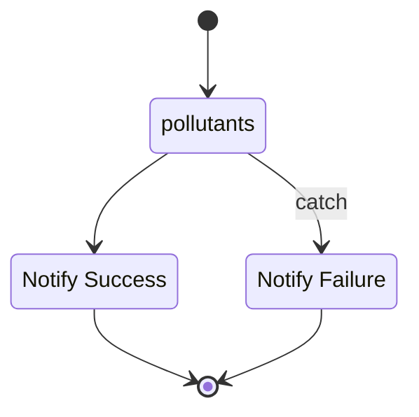

<br>

<span style="color: #777777"><b>IN PROGRESS</b></span>

<br>

master <br>
[](https://github.com/enqueter/pollutants/actions/workflows/main.yml)

develop <br>
[](https://github.com/enqueter/pollutants/actions/workflows/main.yml)

<br>

**Part I**

This package repository retrieves baseline/historical nitrogen dioxide readings recorded at particular *telemetric 
devices locations* within Scotland.  Within Amazon Web Services (AWS), a container instance of the repository is run via a 
**task 
state** of an AWS Step Functions **state machine**.  The container is an instance of this repository.  In brief:

* Foremost, a GitHub Actions event **(a)** builds an image of this repository, **(b)** delivers the image to an Amazon 
  Elastic Container Registry repository.  This occurs automatically on-push to GitHub.

* Next, at runtime the state machine pulls the image from the registry and creates a runtime container.  The container 
  reads the raw data, structures it, and delivers the structured data to a specified Amazon S3 (Simple Storage Service) bucket.

* Depending on events, a success or failure notification is raised.  Afterwards, all activated services are terminated.

<br>

<b>State Machine</b>




The task state *pollutants* runs a container that reads historical pollutants data from Scottish Air Quality's data hub.

<br>
<br>

### References

* [The stations metadata of the telemetric devices](https://www.scottishairquality.scot/sos-scotland/api/v1/stations)
* [Monitoring Sites](https://www.scottishairquality.scot/latest/summary)
* [The pollutants that Scottish Air Quality focus on](https://www.scottishairquality.scot/sos-scotland/api/v1/phenomena)
  * [The pollutants dictionary](https://dd.eionet.europa.eu/vocabulary/aq/pollutant/view)
* [The metadata of the timeseries](https://www.scottishairquality.scot/sos-scotland/api/v1/timeseries): The metadata 
  includes a field of unique sequence identification codes.  Each identification code is associated with the 
  continuous pollutant level recordings of a particular pollutant at a particular telemetric devices station.

<br>
<br>

### Rough Notes

Beware, Station 327 might be malfunctioning.  The nitrogen dioxide sequences in focus are:

```yaml
sequence_id (station_id):
  155 (901), 531 (1014), 177 (460), 150 (791), 165(327), 142 (196)
```

```json
[
  {"id":901,"label":"901-Edinburgh St Leonards-Nitrogen dioxide in air","type": "urban background",
    "start": "24/11/2003", "url": "https://www.scottishairquality.scot/latest/site-info/ED3"},
  {"id":1014,"label":"1014-Edinburgh Nicolson Street-Nitrogen dioxide in air","type": "roadside",
    "start": "01/12/2017", "url": "https://www.scottishairquality.scot/latest/site-info/EDNS"},  
  {"id":460,"label":"460-Edinburgh Queensferry Road-Nitrogen dioxide in air","type": "roadside",
    "start": "01/01/2011", "url": "https://www.scottishairquality.scot/latest/site-info/ED9"},  
  {"id":791,"label":"791-Edinburgh Currie-Nitrogen dioxide in air","type": "suburban",
    "start": "01/01/2013", "url": "https://www.scottishairquality.scot/latest/site-info/ED11"},  
  {"id":327,"label":"327-Edinburgh Gorgie Road-Nitrogen dioxide in air","type": "roadside",
    "start": "01/01/2005", "url": "https://www.scottishairquality.scot/latest/site-info/ED5"},  
  {"id":196,"label":"196-Edinburgh St John's Road-Nitrogen dioxide in air","type": "kerbside",
    "start": "03/01/2007", "url": "https://www.scottishairquality.scot/latest/site-info/ED1"}
]
```


<br>
<br>

<br>
<br>

<br>
<br>

<br>
<br>
